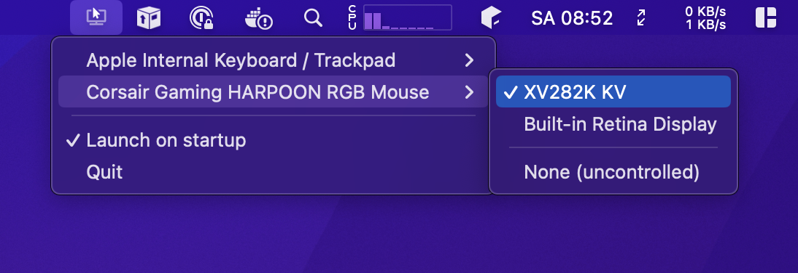
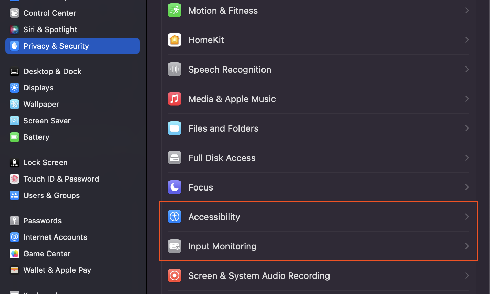
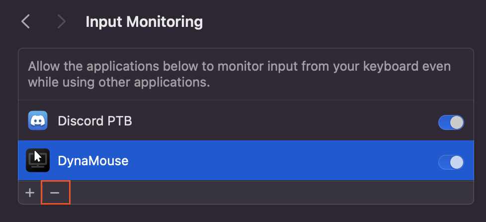

# DynaMouse

## Into

Finally, a system for Mac that allows you to have multiple mice, multiple monitors and assign each to one another. 
While Mac allows for multiple mice plugged-in at the same time, it doesn't allow multiple _cursors_ at the same time. 

DynaMouse allows you to assign a specific display to a dedicated mouse device (including the built-in mac trackpads) so that when you have multiple screens in a studio-like/complex workstation setup (and far apart from each other), you don't have to drag your mouse over to the other screen.

Behold:

When you first start DynaMouse and start configuring it, you will be asked to enable a few settings in System Preferences so that Dynamouse can:

* Access HID devices
* Control the mouse position
* Get current displays

## Features

* Works as a system tray, doesn't appear in the dock
* Supports infinity monitors and pointer devices
* Assign multiple mice to the same monitor
* Configure specific mice to be uncontrolled (not governed by DynaMouse)
* Each mouse's position is remembered on each screen
* Non-obtrusive: doesn't lock the mouse to screen bounds, i.e. you can still drag a mouse to a different screen.
* Setting to launch on login.

## Devices tested

The devices below have been tested and work:

* Corsair HARPOON RGB Gaming Mouse
* Corsair HARPOON Wireless RGB Gaming Mouse
* Apple magic trackpad (‎MMMP3AM/A)
* M1 Macbook trackpad

## Updating

If you are updating to a newer version, you will need to first completely remove the assigned permissions in System Preferences
by pressing the minus button for both 'Input Monitoring' and 'Accessibility'. The reason for this is because the MacOS sandboxing system
sees the new version as having different code signature (hash) and throws the error:

`Failed to match existing code requirement for subject projectstorm.dynamouse and service kTCCServiceListenEvent`

I would appreciate some help on fixing this :)

## Development

1. `pnpm install`
2. `pnpm watch`
3. `pnpm start`

### Releasing

Binaries are auto-created and a release is published when a new tag is pushed to master. 
