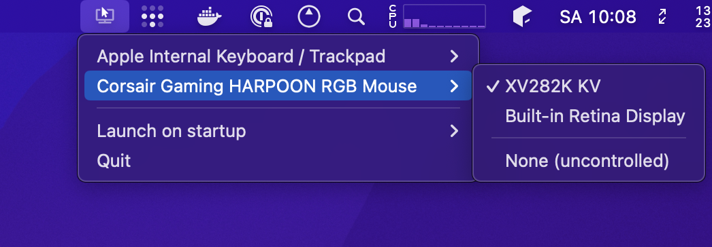
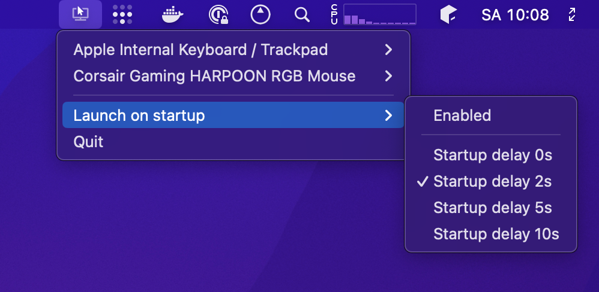

# DynaMouse

## Intro

Finally, a system for Mac that allows you to have multiple mice, multiple monitors and assign each to one another.
While Mac allows for multiple mice plugged-in at the same time, it doesn't allow multiple _cursors_ at the same time.

DynaMouse allows you to assign a specific display to a dedicated mouse device (including the built-in mac trackpads) so that when you have multiple screens in a studio-like/complex workstation setup (and far apart from each other), you don't have to drag your mouse over to the other screen.

Behold:

When you first start DynaMouse and start configuring it, you will be asked to enable Accessibility permissions in System Preferences so that DynaMouse can monitor usb pointer devices and also control the mouse position on the screen. Dynamouse will wait for these permissions to be enabled before continuing to boot up :)

## Features

* Works as a system tray, doesn't appear in the dock
* Supports infinite monitors and pointer devices
* Assign multiple mice to the same monitor
* Configure specific mice to be uncontrolled (not governed by DynaMouse)
* Each mouse's position is remembered on each screen
* Non-obtrusive: doesn't lock the mouse to screen bounds, i.e. you can still drag a mouse to a different screen.
* Can be configured to launch on login.
* Can handle usb devices being attached / detached
* Specify a startup delay (useful when various devices are busy booting up after login)

## Devices tested

The devices below have been tested and work:

* Corsair HARPOON RGB Gaming Mouse
* Corsair HARPOON Wireless RGB Gaming Mouse
* Apple magic trackpad (‎MMMP3AM/A)
* M1 Macbook trackpad

## Troubleshooting

* You can enable file logging which will log to `~/Library/Logs/@projectstorm/Dynamouse` (this can help with submitting an issue)
* Apple startup items seem use the exact binary at the time of installation, so if you are updating to a newer version, try disabling and re-enabling startup mode to install the newer version of the software
* You may need to remove and re-add Dynamouse accessibility permissions across versions (but I seem to no longer run into this after version 1.0.0)

## Development

1. `pnpm install`
2. `pnpm watch`
3. `pnpm start`

### Releasing

Binaries are auto-created and a release is published when a new tag is pushed to master.
