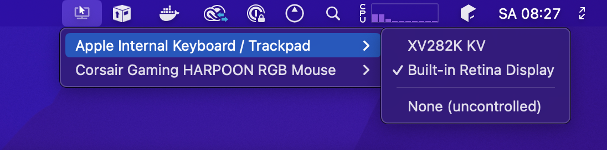

# DynaMouse

Finally, a system for Mac that allows you to have multiple mice, multiple monitors and assign each to each other. 
While Mac allows for multiple mice plugged-in at the same time, it doesnt allow multiple cursors at the same time. DynaMouse allows you to assign a specific display to a dedicated mouse device (including the built-in mac trackpads) so that when you have multiple screens in a studio-like setup, but far apart from each other, you dont have to drag your mouse over to the other screen.

Behold:

